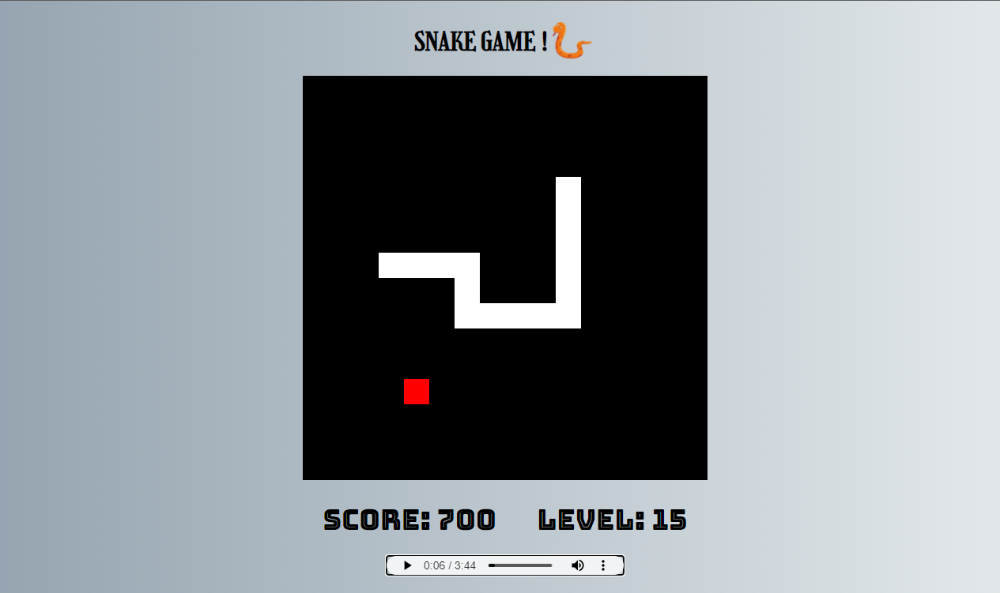

# Snake Game


<p align="center">
  <a href="#-tecnology">Tecnology</a>&nbsp;&nbsp;&nbsp;|&nbsp;&nbsp;&nbsp;
  <a href="#-project">Project</a>&nbsp;&nbsp;&nbsp;|&nbsp;&nbsp;&nbsp;
  <a href="#-license">License</a>
</p>

<p align="center">
 

  
</p>

<br>

## 💻 Project

<p>Este projeto foi desenvolvido através da plataforma de cursos Digital Innovation One. Este é jogo da cobrinha feito em HTML, CSS, Javascript...
minhas implementações:</p>
<ul>
    <li>Implementado um score que vai somando os pontos.</li>
    <li>adicionado um nivel que vai subindo cada vez que você vai conseguindo pontos e a velocidade do jogo vai ficando cada vez mais rápida.</li>
    <li>Um novo estilo de css.</li>
    <li>colocado um player de som na página.</li>
</ul>  

# Link para testar (desktop)

https://laughing-snakegame.netlify.app/

# Preview 🛰

<p align="center">
  
</p>

## 🚀 Technology

This project was developed with the following technologies:

- [HTML](https://html.com/)
- [CSS](https://www.w3schools.com/css/css_website_layout.asp)
- [javaScript](https://www.javascript.com/)

## 🛠 Install

1. Clone o repositório:

   ```bash
   $ git clone https://github.com/edsnasc/snake-game-javascript.git
   ```
2. execute no seu browser 

3. controles ◀🔺🔻▶

## 📝 License

This project is under the MIT license. See the [LICENSE] file (LICENSE.md) for more details.

---

Created by Edson Nascimento / [LinkedIn](https://www.linkedin.com/in/edson-nascimento-5783681aa/)